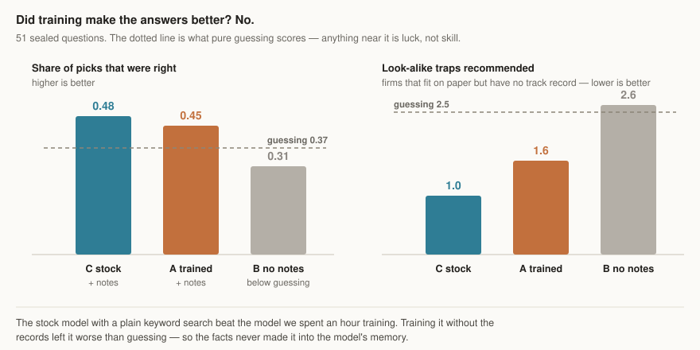
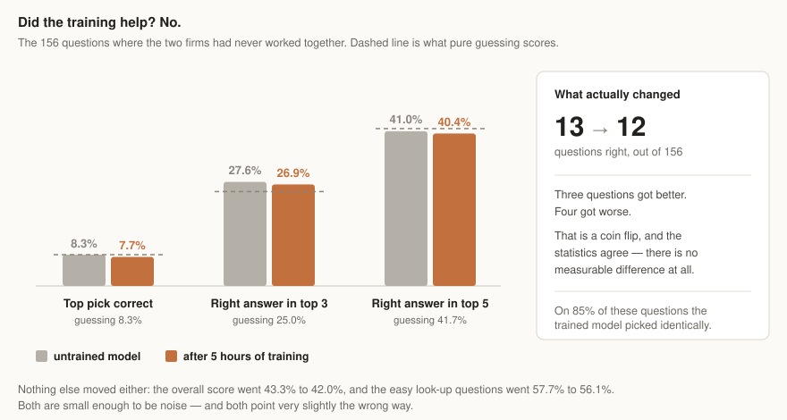

# finetune-lab

**Two experiments on the same question: what is actually worth teaching a small AI model?**

You can hand a model documents at the moment you ask a question — the way you
would hand a new hire a folder before a meeting. Or you can train the model
itself. Training is expensive and everyone assumes you need it. This repo tests
that assumption twice, on real data, with answers nobody made up.

---

## The data, and why it is a fair test

Every year the U.S. government publishes which companies won contracts, and
which smaller companies those winners hired to help. That gives a map of who has
really worked with whom: **15,516 working relationships among 4,423 companies,
2015 to 2025.**

Two things keep this honest:

- **Nobody wrote the answer key.** The right answer is a matter of public
  record, so every approach can be wrong, including ours.
- **The test questions are sealed.** They come from contracts signed *after* the
  cutoff of everything the model was trained on. It cannot pass by remembering.

## Experiment one: teaching a model facts

**[→ Supervised fine-tuning](src/ftlab/sft/README.md)**

We trained the model on hand-written examples and compared it against the
untrained model with a plain keyword search.



**Training did not make the answers more accurate.** It did make them
disciplined — short, on-topic, and finished. Use retrieval for facts, training
for behaviour.

## Experiment two: teaching a model to reason

**[→ Reinforcement learning](src/ftlab/rl/README.md)**

The first experiment tried to put facts *into* the model. This one leaves the
facts outside, in the documents, and tries to improve the model's **judgement**
about them.

The test: hide a real subcontract, show the model twelve plausible candidates,
and ask which company actually got the work. Right or wrong is history, not
opinion, so the model can be scored automatically and trained against that
score.



**Two findings, one solid and one open.**

The solid one: the untrained model scores **exactly chance** on the half of the
test that matters — the cases where the prime contractor had never used that firm
before. Not just on its first pick, but anywhere in its ranking. All of its
apparent 43% skill was looking up who someone worked with last time.

The open one: **five hours of training did not change that.** 13 questions right
became 12. Three got better, four got worse — a coin flip. But the training was
badly starved: 62% of the questions it practised on were the easy look-up kind
that teach nothing, leaving perhaps 60 real examples. A starved run and an
unlearnable task look identical from here, and this experiment cannot tell them
apart. That is the next thing to fix, not a prediction that fixing it will work.

---

## How the code is organised

| | |
|---|---|
| [`src/ftlab/shared/`](src/ftlab/shared/) | the parts both experiments use — data, model loading, the company records, the scoring |
| [`src/ftlab/sft/`](src/ftlab/sft/README.md) | supervised fine-tuning |
| [`src/ftlab/rl/`](src/ftlab/rl/README.md) | reinforcement learning |

Everything runs on one desktop machine with one graphics card. Nothing touches
the cloud.

## Reading further

| | |
|---|---|
| [AGENTS.md](AGENTS.md) | working notes on running these experiments |
| [PLAN.md](PLAN.md) | the experiment design in full |
| [benchmarks/](benchmarks/) | every run, with its full per-question output |
| [docs/ENGINEERING.md](docs/ENGINEERING.md) | how the training tool itself works |

**Every result is checked against a floor.** Each number here sits next to what
random guessing scores on the same questions, and next to simple rules that use
no model at all. A method that cannot beat those is not measuring what it claims
to measure, however good its score looks alone.

## Running it

```bash
uv sync --extra dev
uv run pytest
```

138 tests, no graphics card or network needed. Then see the two READMEs above for
what each experiment runs.
