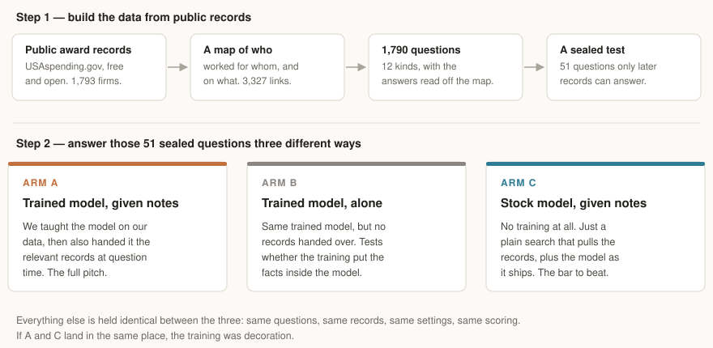
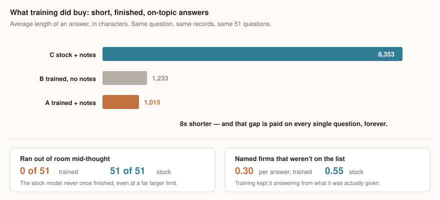

# finetune-lab

**A test of one idea: is it better to *teach* a small AI model your data, or to just let it *look things up*?**

Teaching a model your data is called fine-tuning. It is the thing everyone assumes
you need. The cheaper alternative is to leave the model alone and hand it the right
documents at the moment you ask a question — the way you would hand a new hire a
folder before a meeting.

This repo builds both, on the same real data, and scores them side by side.

---

## How it was set up



The data is public. Every year the U.S. government publishes which companies won
contracts, and which smaller companies those winners hired to help. That gives a
map of who has actually worked with whom — 1,793 firms and 3,327 working
relationships.

Two things make this a fair test rather than a flattering one:

- **Nobody made up the answers.** The right answer is a matter of historical
  record. All three approaches can be wrong.
- **The test questions were sealed off.** They are answered by records dated
  *after* the training data ends. 71% of the correct pairings appear nowhere in
  what the model was taught. It cannot pass by remembering.

## What was run

| | |
|---|---|
| model | Gemma 4, 12 billion parameters, running locally |
| hardware | one desktop graphics card (RTX 5090) |
| training | 1,829 examples, 2 passes, 1h 25m |
| electricity | about $0.13 |
| the test | 51 sealed questions, scored three ways |

Nothing here touches the cloud. It runs on one machine.

## What happened


**The training did not make the answers more accurate.** The untouched model with
a plain keyword search picked better firms than the model we trained, and fell for
fewer look-alike traps. Both beat random guessing, so both are doing real work —
but the expensive one is not ahead.

**Training alone was worse than guessing.** When we took the records away and made
the trained model answer from memory, it scored below chance. The facts never got
into the model. This is the clearest result in the project.



**But training bought something else entirely: discipline.** The trained model
gives an answer, sticks to the options it was handed, and stops. The stock model
never once finished a complete answer, even when given far more room, and
wandered off-topic about twice as often. Eight times shorter, on every question,
forever.

### So, plainly

Use retrieval for facts. Use fine-tuning for behavior. That is not a compromise
between the two results — it is what both results independently say.

### What this does *not* prove

Small print worth reading, because it is easy to over-claim from one experiment:

- 51 test questions is a small number. A few points either way is noise.
- Only 591 facts were available to train on. That is very little.
- The task is genuinely hard — it asks who a company will hire *next*.
- Different training settings were not swept. This is one recipe, not the best one.

The honest headline is: **on this task, at this size, fine-tuning did not buy
accuracy — it bought cost and control.**

---

## Reading further

| | |
|---|---|
| [PLAN.md](PLAN.md) | the full experiment design, metrics, and limits |
| [benchmarks/2026-08-28-real-3arm-v2/RESULT.md](benchmarks/2026-08-28-real-3arm-v2/RESULT.md) | the result in detail |
| [benchmarks/](benchmarks/) | every run kept, including the wrong ones |
| [docs/ENGINEERING.md](docs/ENGINEERING.md) | how the training tool itself works |

**A warning about the history.** Several early results in this repo were wrong,
and the commit messages say so. The answer key once leaked into the questions. A
length check misfired and reported 61% of answers cut off when none were. A text
parser silently matched an invisible character and did nothing. Each was caught by
a sanity check — replaying the known answers, or comparing against random
guessing — which is the whole argument for having those checks.

## Running it

```bash
uv sync --extra dev
uv run ftlab doctor
uv run ftlab train -c smoke.yaml
```

`doctor` confirms the graphics card actually works before you spend an hour on it.
`smoke.yaml` runs the entire pipeline on a tiny model in about a minute.

To rebuild the real experiment:

```bash
uv run ftlab real-build
uv run ftlab train -c real-3arm.yaml
uv run ftlab arms -c real-3arm.yaml
```

Tests: `uv run pytest` — 217 of them, no graphics card or network needed.
