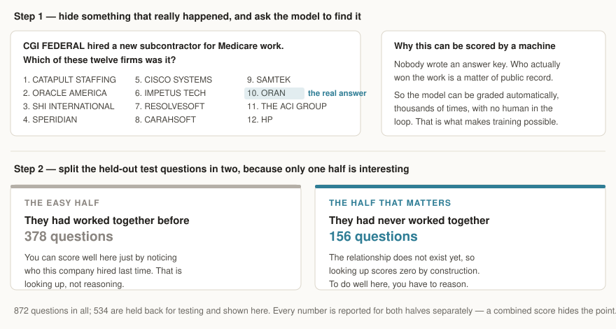
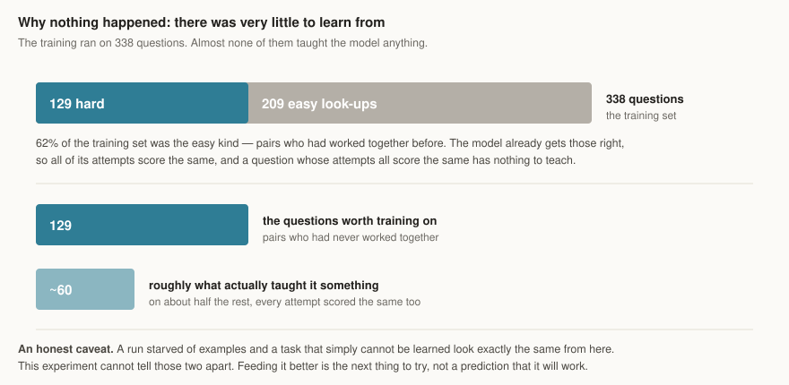

# Reinforcement learning

**Can training improve a model's judgement, if it cannot put facts into it?**

The [first experiment](../sft/README.md) found that fine-tuning did not teach the
model facts — the untrained model with a keyword search was just as accurate.
What training *did* buy was discipline.

So this one stops trying to teach facts. The facts stay outside, in documents the
model is handed. What gets trained is the **reasoning** it does over them.

---

## The test



Take a subcontract that really happened after the cutoff date. Hide who got it.
Show the model the prime contractor, twelve plausible candidate firms, and the
public record for each one. Ask which company actually won the work.

Right or wrong is history, not opinion. That is the whole reason this works:
the model can be scored **automatically, thousands of times**, without anyone
writing an answer key. Training against a score nobody authored is the difference
between reinforcement learning and guesswork.

**872 questions, 162 prime contractors.** 338 are used for training and **534 are
held back for testing**. Both sets split the same two ways, and only one half is
interesting:

| test questions | count | what it measures |
|---|---|---|
| the prime had used this firm before | 378 | can the model read a partner list |
| **the prime had never used this firm** | **156** | can the model actually reason |

On the first half you can score well by counting who someone worked with last
time. On the second half that strategy scores **zero by construction** — the
relationship does not exist yet.

## The starting point

We measured the untrained model first, because a result without a baseline is not
a result.

| | hit rate | random guessing |
|---|---|---|
| all questions | 43.3% | 8.3% |
| had worked together before | 57.7% | 8.3% |
| **never worked together** | **8.3%** | **8.3%** |

**Exactly chance.** 13 correct out of 156 — one in twelve, to four decimal
places.

The headline 43% is entirely look-up. Given a prime contractor it had never seen
paired with any of these firms, the model with full access to every company's
record has **no signal at all**. That is the honest starting line.

## How training works

For each question the model writes several different answers. Each is scored, and
the ones that beat the group's average get reinforced. Nothing is compared
against a "correct" essay — only against whether the right company was named, and
how near the top.

The score is deliberately plain:

- **1.0** for naming the right firm first, 0.5 for second, down to 0.2 for fifth
- **−0.1** for each company named that was not on the list
- **−0.2** for not answering at all

It scores the ranking and nothing else. Rewarding the *explanation* would mean
rewarding whatever we think an explanation should look like, which is the
hand-written answer key problem wearing a disguise.

**Training and test share no companies.** The 338 training questions and the 534
test questions come from separate prime contractors. Splitting them any other way
would let the model memorise one firm's suppliers during training and then score
on that same firm at test time.

## The result


**Training did not improve the model.** One pass, 169 steps, 4h 51m.

| never worked together (156 questions) | untrained | trained | guessing |
|---|---|---|---|
| top pick correct | 8.3% | 7.7% | 8.3% |
| in top three | 27.6% | 26.9% | 25.0% |
| in top five | 41.0% | 40.4% | 41.7% |

13 right became 12 right. Three questions got better, four got worse. That is a
coin flip, and the statistics agree: there is **no measurable difference**.

Nothing else moved either. The overall score went 43.3% to 42.0%, and the
look-up questions went 57.7% to 56.1% — both small enough to be noise, both
pointing very slightly the wrong way.

### Why



Two numbers from the run explain it.

**The trained model gives almost the same answers.** On the questions that
matter, **85% of its top picks were identical to the untrained model's**, and its
answers were the same length. After nearly five hours it is nudging a ranking
here and there, not thinking differently.

**There was very little to learn from.** Of the 338 training questions, **209
were the easy look-up kind**. The model already gets those right, so all its
attempts score the same, and a question whose attempts all score the same
teaches nothing. That is why over half of every training step was wasted. The
real teaching material was closer to **60 questions**.

So this run was starved. But an honest caveat: a starved run and a hopeless task
look the same from here. This experiment **cannot tell those two apart**, and it
would be over-claiming to say the method works and merely needs more food.

What it does show, clearly, is that the untrained model has **no signal at all**
on pairings it has not seen — not just on its first pick but anywhere in its
ranking — and one pass of this training did not create any.

### Next

1. **Train only on the hard questions.** Roughly doubles the useful signal for
   the same hours. Nearly free to do.
2. **Have the model write more attempts per question**, so there is more chance
   they differ enough to learn from.
3. Only then adjust the learning rate or run longer.

---

## What is in here

| | |
|---|---|
| `reward.py` | turns an answer into a score |
| `rollout.py` | runs the model over a set of questions and scores the results |
| `train.py` | the training loop |

## Running it

```bash
uv run ftlab masked-build                       # build the questions
uv run ftlab masked-run -c real-3arm.yaml       # measure a model
uv run ftlab masked-train -c real-3arm.yaml     # train one
```

**Before starting a long run, read the efficiency notes in
[AGENTS.md](../../../AGENTS.md).** Two runs were lost to the same failure: the
graphics card quietly runs out of memory, reports no error, and everything just
gets four times slower. There is a checklist for it.
